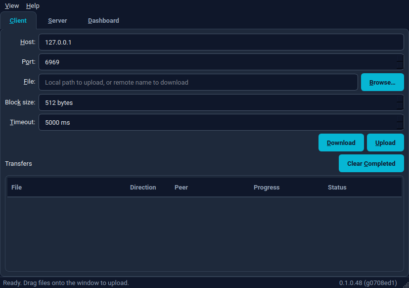
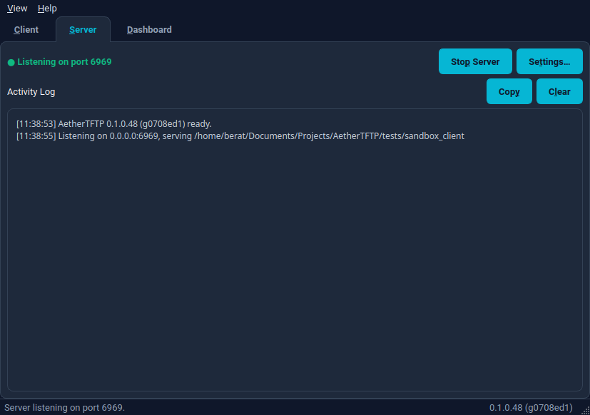
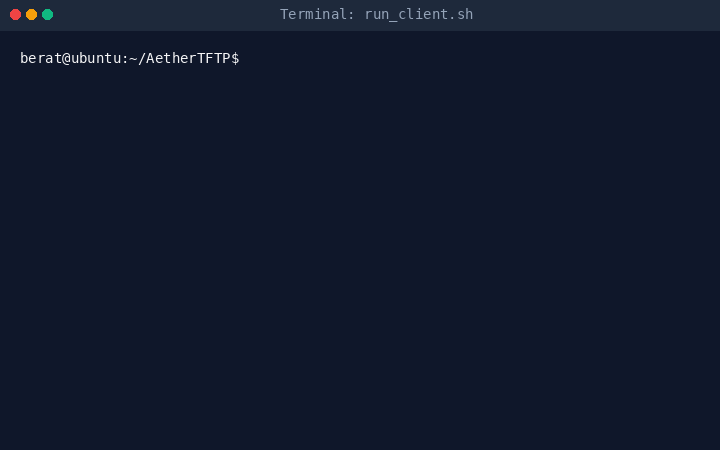
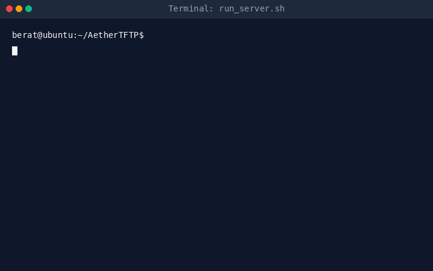

# AetherTFTP

[](https://github.com/beratatmaca/AetherTFTP/actions)
[](https://github.com/beratatmaca/AetherTFTP/actions)
[](https://codecov.io/gh/beratatmaca/AetherTFTP)
[](https://opensource.org/licenses/MIT)
[](https://en.cppreference.com/w/cpp/compiler_support/17)
[](https://www.qt.io/)

AetherTFTP is a modern, lightweight, open-source cross-platform TFTP (Trivial File Transfer Protocol) client and server application.

Written in C++17 and utilizing the Qt 6 framework, it is designed for speed, reliability, and high-block-size network throughput while providing both a headless Command Line Interface (CLI) and an intuitive Graphical User Interface (GUI).

## 🚀 Features

* ⚡ **Fast client and server.**
* 💻 **Runs on Windows, Linux, macOS.**
* 🔌 **Supports both GUI and CLI.**
* 📈 **Uses high block size throughput.**
* 📥 **Queues multiple client transfers.**
* 📥 **Provides system tray integration.**
* 🗺️ **Supports virtual directory mapping.**
* 🛡️ **Filters traffic by IP subnets.**
* 🔒 **Encrypts transfers with symmetric keys.**
* 🔍 **Includes detailed log search filters.**
* ⚙️ **Offers automatic server startup.**
* 🌐 **Includes ProxyDHCP helper for PXE network booting.**

## Installation

AetherTFTP is available for multiple platforms. You can install it using one of the following methods:

### Snap Store (Linux)

AetherTFTP is packaged as a snap for easy installation on Ubuntu and other Snap-supported Linux distributions:

[](https://snapcraft.io/aethertftp)

```bash
sudo snap install aethertftp
```

### GitHub Releases (Linux, macOS, Windows)

You can download pre-compiled packages directly from the [GitHub Releases Page](https://github.com/beratatmaca/AetherTFTP/releases) for easy installation:

* **Linux**: Download the `.deb` package (Debian/Ubuntu-based systems).
* **Windows**: Download the `.msi` installer, or the portable `.zip` (no installation — unzip and run; bundles Qt and the MSVC runtime, so nothing else is required on the target machine).
* **macOS**: Download the `.dmg` package.

## Screenshots

### Graphical User Interface (GUI)

AetherTFTP provides a graphical interface: a left panel switches between **Client** and **Server** configuration — you're usually driving one or minding the other, rarely both at once — while a live dashboard, the transfer list, and the activity log stay visible on the right at all times:

|                 Client Panel                 |                 Server Panel                 |
| :------------------------------------------: | :------------------------------------------: |
|  |  |

## Technical Architecture

The architecture separates the core protocol logic from the presentation layer, allowing the engine to be compiled as a static library with zero graphical dependencies.

```text
                  ┌──────────────────────────────────┐
                  │      Core TFTP Engine            │
                  │  (RFC 1350 / 2347 / 2348 / 2349) │
                  └──────────────┬───────────────────┘
                                 │
               ┌─────────────────┴─────────────────┐
               │                                   │
               ▼                                   ▼
 ┌──────────────────────────┐       ┌──────────────────────────┐
 │      CLI Interface       │       │     Qt6 GUI Interface    │
 │  (QCoreApplication)      │       │  (QApplication)          │
 │  QCommandLineParser      │       │  QThread + QTreeView     │
 └──────────────────────────┘       └──────────────────────────┘
```

* **`tftp_protocol`**: A pure data serialization and deserialization layer, operating independently of sockets and threads.
* **`TftpSession`**: Manages the lifecycle of an individual transfer thread-safely, controlling block counters, window flow, timeout retransmissions, and file stream states.
* **`TftpServer`**: A listener socket that accepts incoming requests and spawns isolated, transaction-specific sessions.

---

## Getting Started

### Prerequisites

To build AetherTFTP, you will need:

* **CMake** (v3.16 or higher)
* **Qt6 SDK** (specifically the `Core`, `Network`, and `Test` modules)
* **C++17 compliant compiler** (GCC 10+, Clang 12+, or MSVC 2019+)

### Build Instructions

To compile the project:

```bash
# Clone the repository
git clone https://github.com/beratatmaca/AetherTFTP.git
cd AetherTFTP

# Configure and compile (Release mode)
cmake -B build -DCMAKE_BUILD_TYPE=Release
cmake --build build -j$(nproc)
```

To run the unit test suite:

```bash
cmake -B build -DBUILD_TESTING=ON
cmake --build build -j$(nproc)
ctest --test-dir build --output-on-failure
```

---

## Versioning

AetherTFTP uses an **auto-incrementing version** of the form `MAJOR.MINOR.PATCH.BUILD`:

* **`MAJOR.MINOR.PATCH`** — the semantic base, kept in the top-level [`VERSION`](VERSION) file. Bump it by hand for meaningful releases.
* **`BUILD`** — the git commit count (`git rev-list --count HEAD`), which increases automatically with every commit/merge to `main`, so each build gets a unique, monotonically increasing version with no manual edits.

The version is the single source of truth across the whole project:

| Surface                                      | How it gets the version                                   |
| -------------------------------------------- | --------------------------------------------------------- |
| CMake (`PROJECT_VERSION`)                    | `cmake/Version.cmake` resolves it before `project()`      |
| The binary (`aethertftp --version`)          | generated `aether/version.h` (e.g. `0.1.0.42 (g1a2b3c4)`) |
| Packages (`.deb` / `.msi` / `.zip` / `.dmg`) | CPack uses the same full version in filenames             |
| GitHub release page                          | the `version` job in `release.yml`                        |

```bash
# Inspect the resolved version of a build:
./build/aethertftp --version          # -> AetherTFTP 0.1.0.42 (g1a2b3c4)
```

CMake derives the build number from git automatically. CI passes the exact
values in so every matrix runner agrees:

```bash
cmake -B build -DAETHER_BUILD_NUMBER=42 -DAETHER_GIT_SHA=1a2b3c4
```

### Releases

The release pipeline ([`release.yml`](.github/workflows/release.yml)) computes the version once and shares it with every build job and the release page:

* **Push to `main`** → packages are built for Linux/macOS/Windows and published to the rolling **`latest`** pre-release, whose name and notes show the current incrementing version (e.g. *AetherTFTP v0.1.0.42 (latest main)*).
* **Push a `vX.Y.Z` tag** → a normal (non-pre-release) GitHub Release named after the tag. To cut one, set `VERSION` to `X.Y.Z`, commit, then:

  ```bash
  git tag v0.2.0 && git push origin v0.2.0
  ```

---

## Usage Reference

By default, calling `aethertftp` without arguments launches the Graphical User Interface (GUI). When arguments (such as `--server`, `--get`, or `--put`) are supplied, the application automatically launches in headless Command Line Interface (CLI) mode.

To explicitly force GUI mode when launching with arguments, use the `--gui` flag.

### Headless Server Mode

Spawn a standalone TFTP server listening on port 6969, serving files out of a specified directory:

```bash
./build/aethertftp --server --port 6969 --dir /var/tftp
```

### PXE ProxyDHCP Boot Server Mode

Spawn a TFTP server with an integrated ProxyDHCP helper listening on UDP port 67 to offer PXE boot parameters (Option 66/67) to PXE network boot clients:

```bash
./build/aethertftp --server --port 69 --dir /var/tftpboot --proxy-dhcp --proxy-bootfile bootx64.efi
```

### Client File Download (Get)

Download a file from a remote server using a custom blocksize of 8192 bytes for faster transfer rates:

```bash
./build/aethertftp --get --host 192.168.1.10 --file firmware.bin --output ./firmware.bin --blocksize 8192
```

### Client File Upload (Put)

Upload a local file to a remote TFTP server:

```bash
./build/aethertftp --put --host 192.168.1.10 --file firmware.bin --timeout 3
```

### Graphical Interface Mode

To open the graphical interface:

```bash
./build/aethertftp --gui
```

### Interactive Peer Testing (CLI)

The repository provides helper scripts to spin up standard `tftp-hpa` clients/servers as independent peers. This lets you visually test or showcase transfers in real-time.

#### 1. Testing GUI Server with `run_client.sh`

Run the client shell script to start an interactive CLI client peer. Point your AetherTFTP GUI server to the sandbox directory and use the CLI client to upload or download files:

```bash
./tests/run_client.sh
```



#### 2. Testing GUI Client with `run_server.sh`

Run the server shell script to launch a standard `tftp-hpa` server daemon. You can then use the AetherTFTP GUI client to perform file transfers to/from this server:

```bash
./tests/run_server.sh
```

> **Note:** `in.tftpd` must run as root (it drops privileges on every request and chroots with `--secure`), so the script re-launches itself with `sudo` and may prompt for your password. `run_client.sh` needs no special privileges.



---

## License

This project is open-source and available under the MIT License.

### Third-Party Software & LGPL Compliance

AetherTFTP links to the **Qt 6** framework, which is licensed under the **GNU Lesser General Public License (LGPL) v3**.

In compliance with the LGPL v3:

* In precompiled releases, the Qt libraries are linked dynamically.
* You can obtain the Qt source code at [qt.io/download](https://www.qt.io/download).
* You are permitted to modify the Qt libraries and relink this application with your modified version, in accordance with the terms of the LGPL v3.
